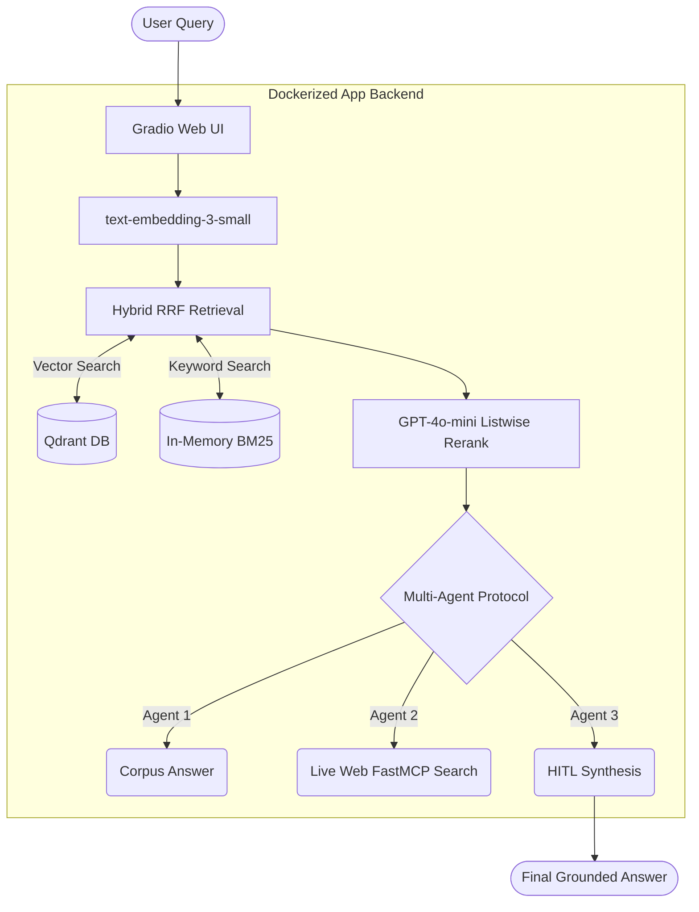

# Européen-AI-Governance-RAG-complianceGPT

<div align="center">
  
  
  
  
  
</div>

<p align="center">
  A production-grade <strong>Multi-Agent RAG</strong> (Retrieval-Augmented Generation) system explicitly built to navigate and answer highly specific queries regarding major AI/data-governance frameworks such as the <strong>EU AI Act</strong>, <strong>GDPR</strong>, and <strong>NIST AI RMF</strong>.
</p>

---

## Features

- **Hybrid Search Engine:** Combines Qdrant vector semantic search (OpenAI `text-embedding-3-small`) with BM25 keyword search, fused via Reciprocal Rank Fusion (RRF).
- **Multi-Agent Pipeline:** Seamlessly delegates between three dedicated async agents (Internal Researcher, External DuckDuckGo Fact-Checker, and Synthesizer) inside the Gradio UI. 
- **Production Infrastructure:** Fully Dockerized architecture separating the Qdrant Vector Engine from the main Python Backend (Gradio UI + FastMCP).
- **Live Fact Ingestion:** Dynamically upload new PDFs via the Web UI to extract, chunk, and index them into Qdrant instantly—without disrupting ongoing users.
- **Human-in-the-Loop (HITL):** Built-in verification controls allowing human moderation to accept, modify, or reject synthetically generated compliance reports.

---

## Architecture



---

## Getting Started

The entire codebase has been fully containerized and streamlined for instant deployment.

### Prerequisites
- [Docker](https://www.docker.com/) & Docker Compose installed.
- An **OpenAI API Key**.

### 1. Configure the Environment
Clone the repository and inject your API key locally in the root directory:
```bash
echo "OPENAI_API_KEY=sk-proj-your-key-here" > .env
```

### 2. Launch the Application
Spin up both the lightweight Backend UI and Qdrant Database effortlessly:
```bash
docker compose up --build -d
```
*The UI will launch natively at **http://localhost:7860**.*

### 3. Build the Initial Corpus Database
Since Qdrant launches empty in a fresh environment, feed it the foundational PDF compliance documents:
```bash
# Safely execute the ingestion pipeline across the running container
docker compose exec backend python -m scripts.index_data
```
*You can track operations happening safely behind the scenes via `docker compose logs -f backend`.*

---

## Usage Guide

### Agentic Mode (Web Fact-Checking)

1. Open up **http://localhost:7860** on your browser.
2. Tick the **Enable Agentic Workflow** checkbox in the sidebar.
3. Fire a question. The pipeline will synthetically retrieve framework compliance definitions from your local PDFs, dispatch an external MCP proxy to cross-validate against DuckDuckGo, and combine both perspectives while attributing precise PDF source pages.

### Dynamic PDF Indexing
Notice a compliance update drop midway through the day? Bypass terminal restarts entirely.
1. Open the "Load a New PDF" accordion.
2. Drop in your new PDF document. The pipeline extracts, chunks, and queues the facts.
3. Click **🔄 Re-index Live Facts** to pump the vectors directly into the live Qdrant container structure natively mapped to your workspace.

---

## Engineering Standards

- **CI/CD Quality:** Enforced robust `pytest` pipelines and `ruff` linting across GitHub Actions on every Pull Request.
- **Log Telemetry:** Console prints have been entirely replaced by a thread-safe rotating `app/logger.py` module generating localized `app.log` files securely managed on the host through Docker Volumes.
- **Concurrency & Scaling:** The local JSON FAISS indexing script was deprecated and completely rewritten as an ephemeral script backing up natively into a stable Qdrant Container designed natively to handle highly concurrent requests across the UI. 

---

<p align="center">
  <i>Created by Vedant, Developed for the Kaggle AI Assistants & Enterprise Engineering Hackathon.</i>
</p>
